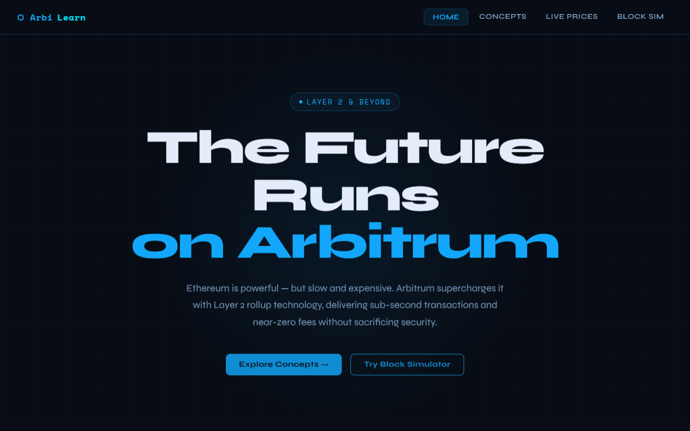
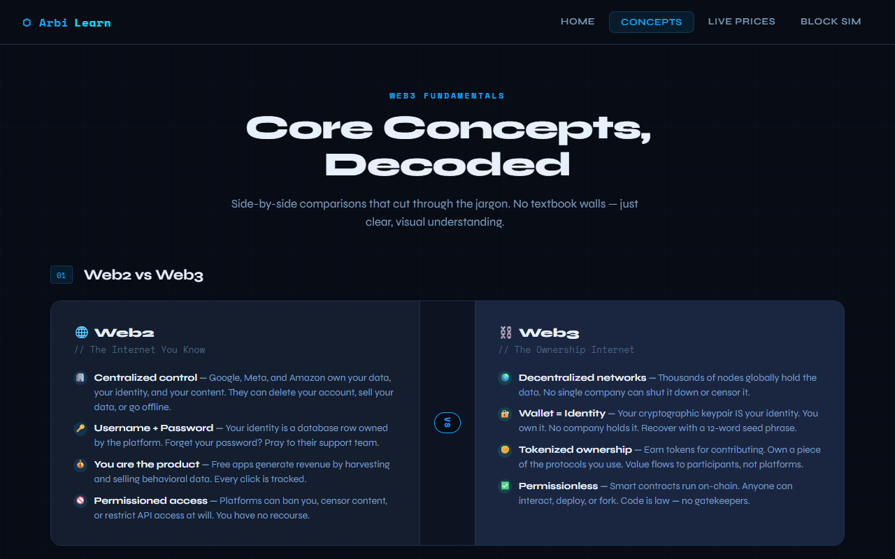
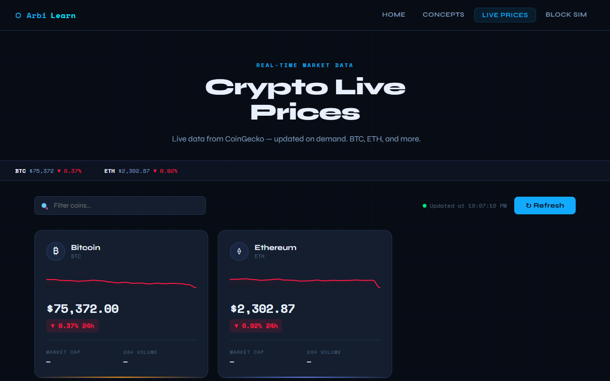
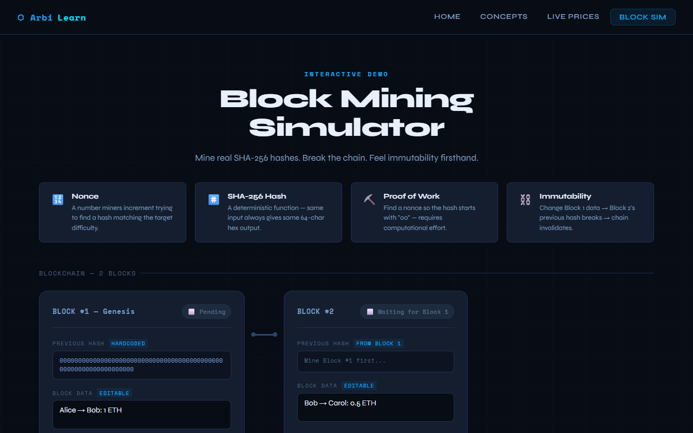
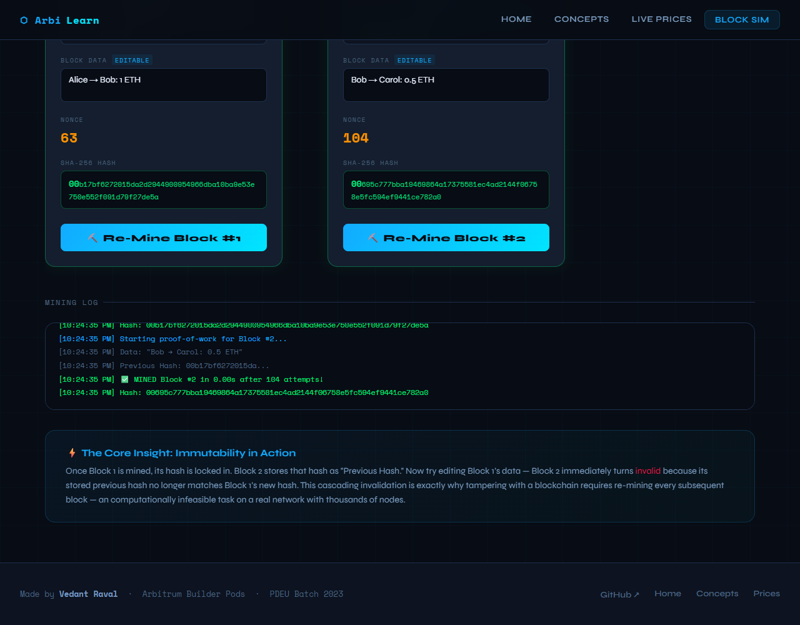

# ArbiLearn — Web3 Explorer

> A 4-page educational website covering core Web3 concepts, built for the **Arbitrum Builder Pods** assignment.  
> Theme: **Arbitrum & Layer 2 Overview**


---

## 📄 Pages

| Page | File | Description |
|------|------|-------------|
| **Home / Landing** | `index.html` | Arbitrum & Layer 2 overview — hero, features, Rollup explainer, stats |
| **Concepts** | `concepts.html` | Visual comparison cards: Web2 vs Web3, ETH vs BTC, Public vs Private Key, Blockchain vs DB |
| **Live Prices** | `prices.html` | Real-time crypto dashboard via CoinGecko API — BTC, ETH, SOL, ARB, POL, LINK |
| **Block Simulator** | `simulator.html` | Interactive SHA-256 mining simulator with 2-block chain and immutability demo |

---

## 📸 Screenshots

| Home Page | Concepts Page |
| :---: | :---: |
|  |  |
| **Live Prices** | **Block Simulator** |
|  |  |

> [!TIP]
> **Block Simulator Detail**: Below is the "Mining Log" and insight section of the simulator, showing the proof-of-work history and immutability logic in action.
>
> 

---


## 🚀 How to Run Locally

### Option 1 — Just open the files (simplest)
```bash
git clone https://github.com/Veds20/arbilearn-web3
cd arbilearn-web3
# Open index.html in any browser
```

### Option 2 — Local dev server (recommended to avoid CORS)
```bash
# Using Python
python3 -m http.server 3000

# Or using Node.js
npx serve .

# Then visit: http://localhost:3000
```

> **Note:** The Live Prices page fetches from the CoinGecko public API. Running via a local server avoids any CORS issues.

---

## 🛠 Tech Stack

- **HTML5** — Semantic markup, no frameworks needed
- **CSS3** — CSS variables, Grid, Flexbox, animations, custom design system
- **Vanilla JavaScript** — Fetch API, Web Crypto API (SHA-256), Canvas API (sparklines)
- **CoinGecko Public API** — Free, no API key required
- **Google Fonts** — Syne (display) + Space Mono (monospace)

---

## ✨ Features

### Page 1 — Home
- Arbitrum/Layer 2 theme with animated hero
- Live stats bar (fees, TPS, TVL)
- 6 feature cards with hover effects
- L2 Rollup explainer with block visualization
- Section explaining: why L2 was needed, what Arbitrum does, real-world benefit

### Page 2 — Concepts
- Web2 vs Web3 side-by-side comparison
- Bitcoin vs Ethereum detailed table (8 properties)
- Public Key vs Private Key cards with examples
- Blockchain vs Traditional Databases comparison

### Page 3 — Live Prices
- Fetches BTC, ETH, SOL, ARB, POL, LINK from CoinGecko
- Price cards with 24h change % and directional arrows
- Trend sparklines drawn with HTML Canvas
- Refresh button + 60-second auto-refresh
- Search/filter bar
- Market ticker strip

### Page 4 — Block Simulator
- Real SHA-256 hashing via Web Crypto API
- Proof-of-work mining (target: hash starts with "00")
- 2-block chain where Block 2 inherits Block 1's hash
- Live nonce counter during mining
- **Immutability demo**: editing Block 1 data instantly breaks Block 2
- Color-coded valid/invalid/mining states + shake animation

---

## 🎨 Design System

- **Colors:** Dark cyberpunk theme — `#080c14` background, `#12aaff` Arbitrum blue, `#00e676` green, `#ff1744` red
- **Fonts:** Syne (display) + Space Mono (code/values)
- **Shared:** All 4 pages use `styles.css` — consistent nav, footer, cards, animations

---

## ⚠️ Known Issues / Future Improvements

- CoinGecko free tier has rate limits (~10-30 req/min) — if Refresh is clicked too fast, it may return a 429 error with a friendly retry message
- Sparklines are simulated trend visualizations (seeded by 24h change direction), not actual historical price data — a future version could use CoinGecko's `/market_chart` endpoint
- The block simulator's proof-of-work uses "starts with 00" difficulty — a real implementation would use dynamic difficulty adjustment

---

## 👤 Author

**Vedant Raval**  
B.Tech ICT — Pandit Deendayal Energy University, Gandhinagar  
GitHub: [@Veds20](https://github.com/Veds20)  
Batch: Arbitrum Builder Pods 2026

---

*Built with AI assistance as part of the Arbitrum Builder Pods assignment.*
